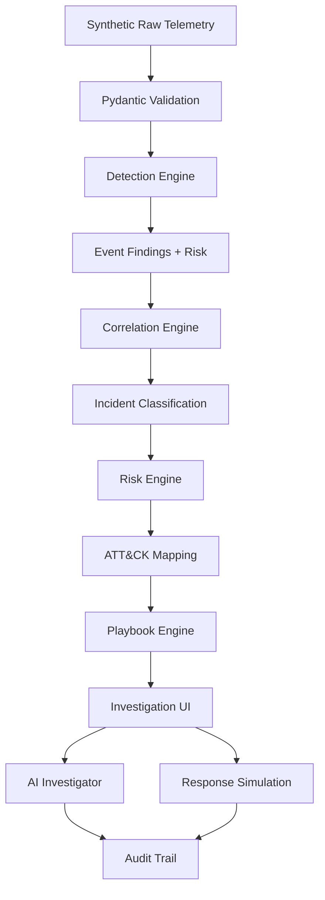
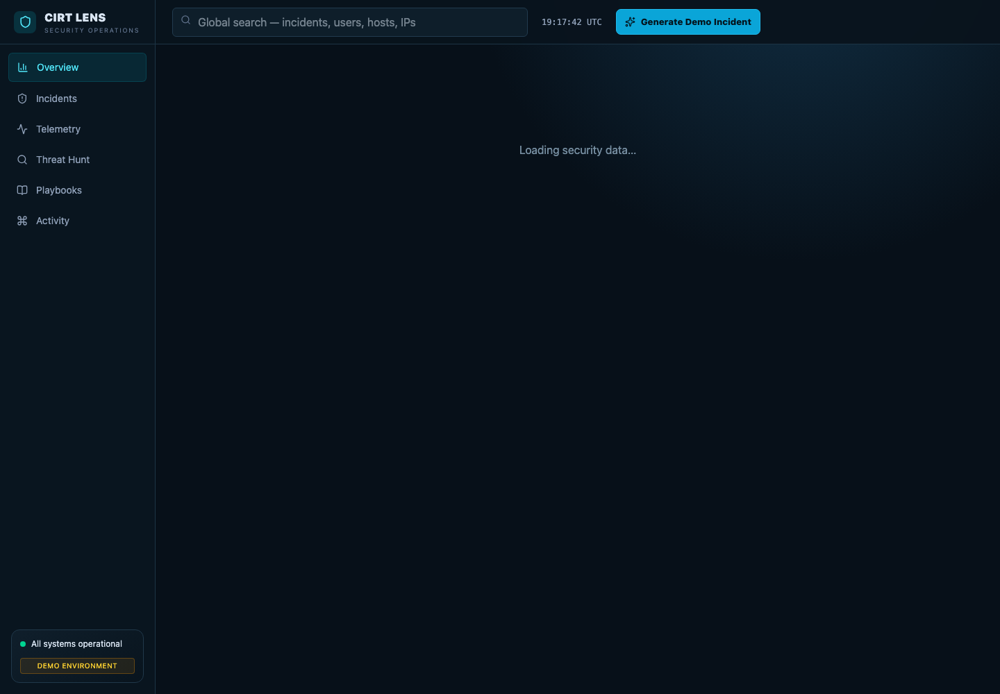

# CIRT Lens

[](https://github.com/samgulati/cirt-lens/actions/workflows/ci.yml)
[](https://github.com/samgulati/cirt-lens/releases)

## Engineering-hardening highlights

- Incremental ingestion queries bounded historical context, so later events can detect and enrich an existing incident across requests.
- Versioned detection findings and event schemas are first-class database records.
- Trusted device baselines are immutable during attack processing; observing a failed or suspicious login cannot silently trust its device.
- Temporal privilege findings require a same-user suspicious authentication that occurred earlier and inside the configured window.
- Risk and evidence confidence (`/100`, not probability) have separate named breakdowns; points require supporting evidence.
- Incident fingerprints, cohesion/span guardrails, case notes, evidence bookmarks, dispositions, containment objectives, and residual-risk history support an auditable lifecycle.
- Structured AI claims require non-empty incident evidence IDs; malformed external output retries once and falls back locally.
- Alembic owns schema upgrades. Docker runs `alembic upgrade head` before starting the API.
- PostgreSQL is the operational store; Redis Streams and a separate worker provide asynchronous, idempotent ingestion with retry and dead-letter handling.
- Signed local JWT authentication, cryptographically verified OIDC JWT support, tenant scoping, four RBAC roles, and two-person approval protect high-impact actions.
- OpenTelemetry instrumentation, Prometheus, a provisioned Grafana dashboard, structured logs, dependency readiness, an evaluation dataset, and CI/release pipelines make the system operable.
- The React frontend is split into lazy-loaded route pages, shared layout/common components, and investigation components; the initial production chunk is 245 KB (78.9 KB gzip).
- Two Playwright interview workflows cover credential and endpoint compromise, including case work, AI grounding, ATT&CK evidence, response simulation, and audit verification with a clean browser console.
- See the [security model](docs/security-model.md) and [performance notes](docs/performance.md).

For native backend startup, run migrations first:

```bash
cd backend
alembic upgrade head
uvicorn app.main:app --reload
```
CIRT Lens is a polished, locally runnable security incident triage and response workbench. It correlates realistic synthetic identity, endpoint, network, and cloud telemetry into evidence-backed investigations with transparent scoring, forensic timelines, simplified MITRE ATT&CK mappings, safe SOAR simulations, and a grounded investigation assistant.

## Problem

Security teams receive alerts from many systems, making it difficult to reconstruct an attack quickly. Analysts must connect identities, devices, IPs, cloud actions, and time before they can make a defensible response decision.

## Solution

CIRT Lens turns multi-source telemetry into coherent investigations and gives analysts a fast path from detection to evidence review, containment, and reporting. Everything is synthetic and response actions are simulations.

## Architecture



The React/Vite frontend talks to a FastAPI API backed by PostgreSQL. Redis Streams decouples ingestion from a detection/correlation worker; SQLite remains available only as a zero-dependency test/development profile. Scenario selection supplies raw observations only; it cannot set findings, incident type, risk, confidence, ATT&CK techniques, or playbooks. See [architecture notes](docs/architecture.md) and the [production platform extension](docs/production-platform.md).

## Features

- SOC overview with operational KPIs, trends, severity, detection sources, and incident queue
- 300+ seeded events, 30+ suspicious observations, four users, five hosts, and three built-in attack investigations
- One-click credential compromise, endpoint compromise, and exfiltration demo generation
- Incident centerpiece with overview, expandable timeline, evidence, ATT&CK, response, and AI tabs
- Analyst Case workspace with disposition, notes, evidence bookmarks, and residual-risk history
- Entity-aware threat hunting (`user:`, `host:`, `ip:`, `flag:`)
- Keyboard-accessible global entity search and an evidence-derived entity graph
- Confirmed simulated SOAR execution and auditable activity log
- Immutable original risk with deterministic residual-risk reduction
- Downloadable Markdown incident reports
- Loading, error-safe empty states, confirmations, filters, and responsive charts

## Detection Logic

Deterministic rules detect impossible travel, four MFA denials inside ten minutes, new devices, suspicious PowerShell strings, structured credential access, destinations in a synthetic documentation-range intelligence set, unusual egress, persistence, sensitive resources, and privileged actions. Rules produce explainable findings containing event ID, rule ID, flag, contribution, reason, and metadata. Command lines are inert strings and are never executed.

## Why deterministic detection?

The project prioritizes explainability, reproducibility, and interview-defensible behavior over black-box anomaly detection. Thresholds are configurable through environment variables.

## Risk Scoring

Risk is an explainable 0–100 sum: event evidence (0–40), asset criticality (0–20), behavioral anomaly (0–20), and threat intelligence (0–20). Severity is Low (0–24), Medium (25–49), High (50–74), or Critical (75–100). Every incident exposes its full contribution breakdown.

The stored breakdown sum is guaranteed to equal original risk. Original risk is immutable. Executed simulated actions reduce a separate residual-risk score using documented demonstration reductions.

## Correlation

Suspicious events are connected using an in-memory adjacency list. Candidate buckets avoid comparing unrelated events globally. Shared users/hosts, devices/IPs, source/destination overlap, and temporal proximity contribute explainable edge scores. Weak edges, low-cohesion groups, single-signal groups, and excessive incident spans are rejected. Deterministic fingerprints make reprocessing idempotent while allowing open incidents to be enriched with later evidence.

## AI Grounding

Without an API key, the question-aware deterministic investigator answers using incident evidence. External output must be structured JSON with evidence IDs for every factual claim; IDs must belong to the current incident. Invalid output triggers one retry and then local fallback. This validates evidence ownership and structure, not the truth of a model interpretation. Secrets never reach the browser.

## Why a modular monolith?

Detection, correlation, risk, mapping, playbook, AI, generation, and serialization have clear module boundaries while deployment remains one backend process. That preserves maintainability without premature distributed-system overhead.

## Why synthetic telemetry?

PostgreSQL provides indexed operational persistence while synthetic telemetry makes the public demonstration safe and repeatable without exposing enterprise security or personal data. OpenSearch is intentionally not required for this portfolio-sized dataset; the connector boundary allows it to be added when query volume justifies another datastore.

## Why simulated SOAR?

Real containment requires vendor integrations, scoped authorization, approvals, idempotency, rollback, and blast-radius controls. CIRT Lens demonstrates decision and audit semantics without claiming those integrations exist.

## Running Locally

### Docker

```bash
docker compose up --build
```

Open `http://localhost:5173`. API docs are at `http://localhost:8000/docs`.

Operational views: Prometheus at `http://localhost:9090` and Grafana at `http://localhost:3001` (anonymous local viewer). The API and background worker use PostgreSQL and Redis automatically.

### Native development

```bash
cd backend
python -m venv .venv
source .venv/bin/activate
pip install -r requirements.txt
alembic upgrade head
uvicorn app.main:app --reload
```

In a second terminal:

```bash
cd frontend
npm install
npm run dev
```

## Running Tests

```bash
cd backend
pytest
```

The 52-test backend suite covers positive and negative detection boundaries, tenant-aware RBAC, unauthorized action denial, two-person approval, ingestion idempotency, rule lifecycle/replay, cross-batch enrichment, rollback, hostile-string safety, correlation cohesion, scoring, grounded AI output, and Alembic upgrades. Run `PYTHONPATH=. python evaluation/run_evaluation.py` from `backend` for the labeled evaluation set and `npm run test:e2e` in `frontend` for the two Playwright interview workflows.

## Two-Minute Demo

1. Open the overview and select **Generate Demo Incident**.
2. Choose **Credential Compromise** and generate it.
3. Review the critical score breakdown and reconstructed timeline.
4. Expand raw evidence and inspect simplified ATT&CK mappings.
5. Ask “What probably happened?” in AI Investigator.
6. Execute “Revoke active sessions” in Response and confirm the audit entry.
7. Add a case note, disposition, and evidence bookmark, then inspect risk history.
8. Export the Markdown report.

## Design Tradeoffs

- Synthetic telemetry keeps the project safe and reproducible instead of depending on enterprise integrations.
- Transparent rules demonstrate investigation logic without pretending to provide production anomaly detection.
- SQLite makes local setup immediate; it is not a distributed event store.
- SOAR actions are simulations and cannot mutate real infrastructure.
- ATT&CK mappings are intentionally simplified demonstration mappings, not authoritative classifications.

## External production steps

The remaining environment-owned work is to connect a real OIDC tenant, replace the fake response connector with a vendor sandbox, and deploy the supplied containers/manifests behind public DNS and TLS. Those steps require credentials and infrastructure that are deliberately not committed to this repository.

## Engineering Documentation

- [Architecture deep dive](docs/architecture.md)
- [Security model](docs/security-model.md)
- [Production platform](docs/production-platform.md)
- [Performance notes](docs/performance.md)

Schema changes are managed through Alembic. Existing local and Docker databases should be upgraded with `alembic upgrade head`; deleting the database is only appropriate when the user explicitly wants a fresh synthetic environment.

## Final product


