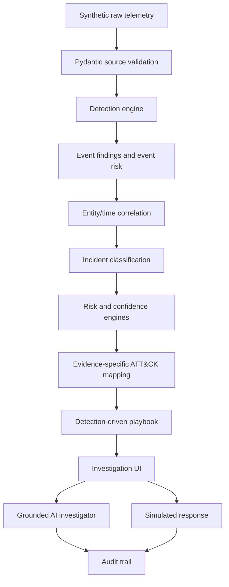

# CIRT Lens Architecture

## End-to-end data flow

`POST /api/demo/generate` selects only a raw telemetry recipe. The generator returns source-specific Pydantic models without risk fields or flags. The pipeline persists normalized observations, runs contextual and event-local detection rules, writes findings back to normalized events, correlates suspicious events, and only then derives the incident type, score, confidence, ATT&CK mappings, and playbook.

## Detection rules

Rules output `DetectionFinding(event_id, rule_id, flag, risk_contribution, reason, metadata)`. Impossible travel compares successful logins for the same identity across countries within 60 minutes. MFA fatigue finds four denials within ten minutes. New-device checks a small user/device baseline. Endpoint rules inspect structured process and event-type fields; command strings remain inert data. Network rules compare `bytes_sent` with a configurable threshold and destinations with documentation-range demo intelligence. Cloud rules use explicit `privileged` and `sensitive_resource` fields.

## Correlation algorithm

The modular monolith uses an in-memory adjacency list, not a graph database. Event-pair relationship weights are: same user +4, same host +4, same device +3, same source IP +3, overlapping source/destination IP +2, within 15 minutes +3, or within 60 minutes +1. Edges below the configured score are rejected. Connected components need at least two events and two independent flags. Exact evidence-set matching prevents duplicate incidents.

## Risk and confidence

Risk is `min(100, suspicious evidence + critical assets + behavioral anomaly + threat intelligence)`, with caps of 40/20/20/20. No category receives points when its supporting event context is absent. Stored breakdown values sum to stored risk. Severity boundaries are 25, 50, and 75. Evidence confidence is a deterministic `/100` support heuristic based on independent detections, telemetry diversity, all-pairs group cohesion (including zero-score pairs), entity correlation, and threat-intelligence support; it is not a probability.

Incremental ingestion queries from the earliest incoming timestamp minus the largest detector lookback through the latest incoming timestamp. Open incidents sharing evidence can be enriched and reclassified while workflow state is preserved; all derived narrative, entities, score, confidence, ATT&CK mappings, and playbook fields are recomputed. Each material enrichment appends risk history.

## ATT&CK mapping

Mappings consume derived findings. Each technique retains only the event IDs responsible for its mapped flags. The UI does not substitute arbitrary risky evidence. Mappings are simplified and non-authoritative.

## Response execution

The API validates that an action belongs to the incident and rejects repeat execution with HTTP 409. Actions are simulations and append an audit entry. Original risk is immutable; residual risk subtracts documented demonstration reductions. Only high-impact containment actions can automatically mark a case contained. Collection and escalation actions do not.

## AI grounding

Only serialized incident metadata, correlated evidence, risk, techniques, and actions are sent to an optional OpenAI-compatible endpoint. Event-ID-shaped citations are checked against incident evidence. Invalid citations trigger one corrected retry, then deterministic fallback. API failures also fall back. Local templates adapt to evidence, scope, next-step, containment, and risk questions.

## Database design

SQLite stores normalized events, incidents, and append-only application activity. Source detail and detection reasons remain in event JSON while commonly searched entities are indexed columns. A small compatibility shim adds new incident fields for existing local databases. During development, deleting `backend/cirt_lens.db` safely regenerates synthetic data.

## Scaling considerations

Production ingestion would place Kafka or a managed stream before validation, use partitioned workers for detection, and persist telemetry in PostgreSQL/OpenSearch or a security data lake. Correlation state would be windowed and partitioned by entity keys. A durable queue would separate detection, correlation, and response. This demo intentionally does not implement those systems.

## Security considerations

Telemetry is validated, query sizes are capped, ORM parameters are used, secrets remain backend-only, and React escapes telemetry. The product executes no telemetry commands, performs no scans, and invokes no infrastructure. Real SOAR would require scoped service identities, approvals, idempotency keys, rollback, rate limits, and blast-radius controls.

## Tradeoffs

A modular monolith preserves clear boundaries without distributed-system overhead. Deterministic rules favor reproducibility and explainability over black-box anomaly detection. Synthetic data enables a safe public demo. SQLite keeps setup immediate. The entity graph is built in memory from incident evidence rather than requiring graph infrastructure.
